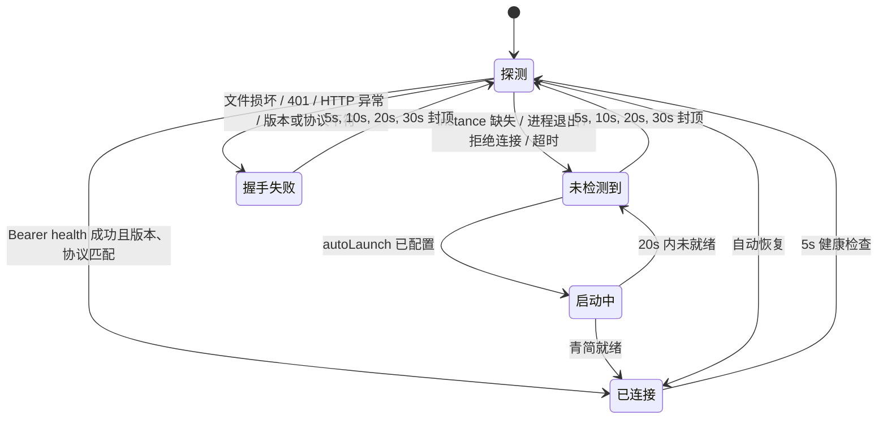

# 未安装 / 未启动青简引导与优雅降级报告

## 实现点

- host 启动后立即探测 `instance.json` 与 external health，失败时按 5s → 10s → 20s → 30s 指数退避，30s 封顶；恢复在线后无需重启 DSH。
- 状态沿用现有 `EngineConnection → BridgeHub (/state + engine-status SSE) → QingClientStore` 通道，没有增加平行 bridge。
- 连接状态细分为 `offline`、`starting`、`online`、`handshake-failed`，并携带结构化 `reason`。握手失败可具体识别：
  - `instance.json` 损坏 / 不可读 / 字段不完整；
  - 401 / 403 实例令牌失效；
  - health 非预期 HTTP 或响应格式无效；
  - 引擎版本与实例记录不符；
  - `attachProtocolVersion` 不兼容。
- 无 instance 文件、进程已退出、连接拒绝或连接超时归入“未检测到可用引擎”，与“检测到但握手失败”分开呈现。
- client 在原 details 纸面区域显示直角暖纸引导卡，包含“下载并安装 → 启动一次 → 自动连接”三步；恢复后自动刷新状态并回到正常面板。
- 下载地址由 `src/onboarding.ts` 中唯一常量 `QINGJIAN_DOWNLOAD_URL` 同时供引导卡和工具错误使用。
- 六个 `qing_*` 工具统一执行连接保护；断连时不暴露底层 `fetch failed` / `ECONNREFUSED`，而是返回安装、启动、自动重连和下载地址。握手失败会保留具体原因。
- 系统提示新增【连接纪律】，禁止 Agent 谎称已连接或编造文稿状态。
- Quick Start 与故障排查已写入 `docs/onboarding.md`；未修改 README。
- 未修改 `tsdown.config.ts`、`scripts/extract-qingdoc-css.mjs` 或其 `QING_ROOT` 定义。

## 状态机



client 恢复链：

```text
engine-status: online
  → QingClientStore 更新同一 BridgeState
  → 重新读取 /qingagent-bridge/state
  → 无文稿：注销引导 details 槽
  → 有文稿：刷新 PM / review model，恢复正常纸面
```

## 测试证据

2026-08-16 在本 worktree 执行：

```text
npm run check
  check:qingdoc-css  PASS
  typecheck          PASS
  test               PASS — 30 files / 158 tests
  build              PASS — host ESM + client CJS
```

新增覆盖：

- 临时假 HOME 下的 `~/.qingagent/instance.json`，不读取或写入真实用户目录；
- 随机高位端口，并显式排除 8080 / 3080；
- 未安装、启动中、已连接、握手失败及失败后恢复；
- 5s 起步的指数退避与恢复后重置；
- 401、坏 JSON、版本不符、attach 协议不兼容、连接拒绝；
- 六个工具在“未检测到”与“握手失败”两类状态下的统一错误映射；
- 引导卡三步文案、下载常量、具体握手原因、暖纸色板、无 `--dsw-*`、全部 `border-radius: 0`；
- engine-status SSE 恢复后引导自动消失 / 正常面板重新加载。

测试优先启动 `127.0.0.1` 随机端口 mock server；当前 Codex 沙箱禁止 `listen(2)` 时，会自动降级到同 wire 的进程内 fetch mock，仍使用随机 endpoint 且不产生任何真实网络访问。

## 遗留

- 无已知功能性遗留。
- `autoLaunch` 继续保持既有的显式 opt-in：未配置 `engineCommand + autoLaunch` 时只做探测与引导，不擅自拉起桌面应用。
- 建议在允许回环监听的 CI 环境保留一次 socket 层运行；当前单测已内置该路径，受限沙箱才使用进程内 fallback。
- 交付环境把共享 Git worktree 元数据挂为只读，`git add/commit` 无法创建 `.git/worktrees/guide/index.lock`；源码与报告均已就绪，解除该限制后可直接执行文末所列提交命令。

```bash
git add ONBOARDING-REPORT.md docs/onboarding.md src tests
git commit -m "完善未连接青简引导与自动恢复"
```
